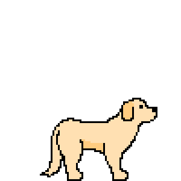
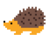
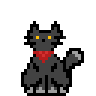

# Pixel Bubi

Mini 2D platformer featuring my dog, Bubi.
There is also a secret adorable photo of real life Bubi.

### Original Art
* Bubi
* Hedgehog enemy
* Secret cat
* Checkpoint torches

### Technologies used

* Unity 2020.1.1
* C#

### Requirements

* Linux or Windows
* 64-bit architecture

### Run Game

#### Linux:
* download folder: LinuxBuild
* run file: Pixel\_Bubi.x86\_64

#### Windows:
* download folder: WindowsBuild
* run file: Pixel\_Bubi.exe
 
